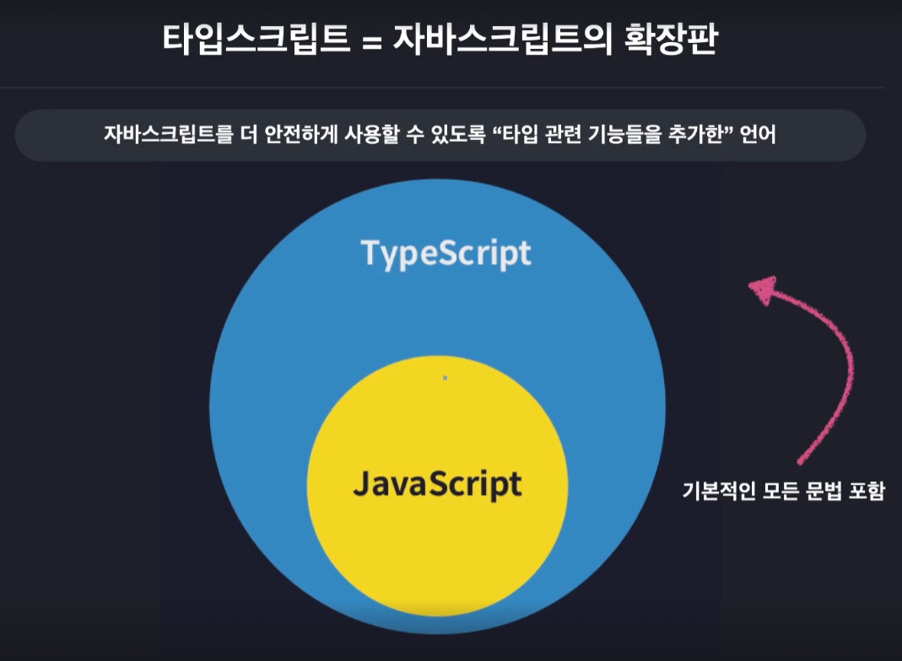

# 한 입 크기로 잘라먹는 타입스크립트

# TypeScript란?

자바스크립트를 더 안전하게 사용할 수 있도록 “타입 관련 기능들을 추가한” 언어

```jsx
npm init //초기화
```

types node 라는 패키지를 설치해야함.

```jsx
npm i @types/node
```

```jsx
npm install typescript -g //컴퓨터 전체에 typescript 설치 (어디에서나 접근)
tsc -v // 타입스크립트 버전 확인
```



```jsx
// JavaScript
let a = 1;
let b = 2;

console.log(a + b);

// TypeScript
let a:number = 1;
let a:number = 2;

```

### Javascript는 어떤 한계가 있는가?

Javascript는 한계점을 어떻게 극복하는가?

TypeScript가 다른 언어 대비 갖는 차별점은 무엇인가?

# TypeSystem

값들을 어떤 기준으로 묶어 타입을 규정할것인가?

코드의 타입을 언제 검사할 것인가?

어떻게 타입을 검사할것인가?

### 정적 타입 시스템

코드 실행 이전

모든 변수의 타입을 고정적으로 결정함

ex) Java, C

### 동적 타입 시스템

코드를 실행하고 나서 그때 그때 마다 유동적으로 변수의 타입을 결정함.

ex) Python, Javascript


`애초에 실행이 안되어야 한다.`

그런데 실행이 되어서 오류를 낸다는게 문제인 것이다.


그래서 잘되는줄 알았는데, 대규모 서비스 도중에 오류가 터지면, 엄청난 비용을 지불해야한다.

C언어나 Java가 그래서 엄격하고 고정적인 시스템을 활용하는데 장점이 있는것이다.


바로 알려준다.

하지만, 정적시스템처럼 많이 작성한다는 단점도 명확히 존재한다.

`그래서 TypeScript는 정적시스템의 장점과, 동적 시스템을 장점을 섞어서 작동시킨다.`


동적 타입 시스템.

변수의 타입을 실행전에 결정. 타입 오류를 실행전에 검사한다.

이렇게 명시하지 않아도 된다는 말이다.


```jsx
//TypeScript
console.log("Hello TypeScript");
const a: number = 1;

//terminal
//..TypeScript\section01> tsc src/index.ts

//index.js
console.log("Hello TypeScript");
var a = 1;
```


이런 코드들이 생겨나는걸 확인할 수 있다.

```jsx
// terminal
//..TypeScript\section01> node src/index.js
Hello TypeScript
```

### 따로 Compile 하고 실행을 반복하기에는 귀찮다.

```jsx
npm install ts-node -g
```

그래서 위와같은 ts-node라는 패키지를 사용한다.

Node.js의 LTS가 20버전대로 올라가면서 ts-node는 더이상 작동하지 않는다.

tsx라는 새로운 도구를 사용하자.

```jsx
// ..TypeScript\section01> tsx src/index.ts
Hello TypeScript
```

## 타입스크립트 컴파일러 옵션 설정

컴파일러 옵션

얼마나 엄격하게 타입 오류를 검사할지, 자바 스크립트 코드의 버전은 어떻게 할지

전부다 하나씩 설정할 수 있다.

```jsx
tsc --init
```

이렇게 하면, tsconfig.json이 나타난다.

- include

```jsx
{
    "include": ["src"]
}
```

이렇게 작성하면 tsc 만 terminal에 입력해도 src폴더 안의 ts 파일을 모두 컴파일해준다.

- compilerOptions

```jsx
{
  "compilerOptions": {
    "target": "ESNext"
    "module": "CommonJS" //ESNext
    "outDir": "dist" // 컴파일 한 결과가 매번 src가 아니라 다른 경로에 나오게 설정하기.
    "strict": "true" // 타입을 반드시 명시해야할지 말지를 결정한다. //strictNullCehcks의 상위 모델이다.
	  "strictNullChecks": false // number에 null을 잠깐 넣어야할때 사용할 수 있음.
    "moduleDetection": "force" //전역 모듈인식에서 export{};를 넣어 벗어나게함.
    "esModuleInterop": true //모듈에서 default로 내보내는게 없어도 허용
  },
  "include": ["src"]
}
```

target은 변환되는 javascript의 버전을 의미한다. "ESNext"는 가장 최신을 의미한다.

- 전역 모듈


`TypeScript는 기본적으로 파일들을 전역 모듈로 인식한다.`

그래서 파일 2개를 따로 때어놓고 변수명이 같으면 오류가 발생한다.

해결법1. export {}; 와 같은 예약어를 한번이라도 사용하면 독립된 모듈로 인식한다.

해결법2. “moduleDetection”: “force” 를 tsconfig.json에 작성해준다.

혹시라도 저장했는데 오류가 발생하면 >restart로 TS서버를 다시 실행시키면된다.

해결법2를 사용하면, 컴파일된 js파일 내부에 export{};가 자등으로 모두 들어가있는걸 확인할 수있다.

# 타입스크립트 기본

## 기본타입


```tsx
//Number
let num1: number = 123;
let num2: number = -123;
let num3: number = 0.123;
let num4: number = -0.123;
let num5: number = Infinity;
let num6: number = -Infinity;
let num7: number = NaN;

num1.toUpperCase() // 작동하지 않음.
num1.toFixed() // 잘 작동함.
```

이때, number를 주석(Annotation)이라고 정의한다.

```tsx
//String
let str1: string = "hello";
let str2: string = 'hello';
let str3: string = `hello`;
let str4: string = `hello ${num1}`

str1.toFixed();
str1.toUpperCase();
```

```tsx
// boolean

let bool1: boolean = true;
let bool2: boolean = false;
```

```tsx
//null

let null1: null = null

let unde1: undefined = undefined;

let numA : number = null -> 허용되지 않음.
//이때 strictNullChecks 옵션을 키면 달라진다.
```

```tsx
// Literal Type
let a: 10 = 10

let strA: "hello" = "hello"
```

위 처럼 코드를 작성하면 a에 10만 계속해서 넣을 수 있게 된다.

다른 데이터가 들어가면 오류가 발생한다.

```tsx
let boolA: true = false;
```

## 배열과 튜플

```tsx
let numArr:number[] = [1,2,3];
let strArr:string[] = ["hello", "im", "seungyun"]
//위와 같은 방식으로 주로 작성한다.

let boolArr: Array<boolean> = [true, false, true];
// 아래와 같은

//배열에 들어가는 요소들의 타입이 다양한 경우는 이렇게 쓴다.
let multiArr: (string | number)[] = [1, "hello"];

// 다차원 배열의 타입을 정의하는 방법

let doubleArr: number[][] = [
    [1,2,3],
    [4,5],
];

//튜플 (길이와 타입이 고정된 배열) -> javascript로 변환시 그냥 배열임.
let tup1: [number, number] = [1,2];
let tup2: [number, string, boolean] = [1,"2",true];

tup1 = [1,2,3]; -> 에러;
tup2 = ["1", "2"]; -> 에러

tup1.push(1); -> ;
tup2.pop();
tup2.pop();
tup2.pop();

//구별하지를 못한다. 그래서 튜플을 쓸 때는 조심을 해야한다. 
```

```tsx
const users = [
    ["이정환", 1],
    ["이아무개",2]
    ["김아무개",3],
    [5, "최아무개"] // ??
] // 이렇게하면 그냥 들어간다.
```

```tsx
const users : [string, number][] = [
    ["이정환", 1],
    ["이아무개",2]
    ["김아무개",3],
    [5, "최아무개"] // ??
]; // 하지만 위와 같은 형식으로 고정할 때, [string, number][]를 넣어주면 된다.
```

## 객체

```tsx
let user: object = {
    id: 1,
    name: "이정환"
};

user.id -> 오류가 발생함. // 객체인것 밖에 인식을 못해서 그럼.
```

```tsx
let user: {
    id: number;
    name: string;
} = {
    id: 1,
    name: "이정환",
};

user.id -> 오류가 발생함.

let dog:{name: string, color: string} = {
    name: "돌돌이"
    color: "brown",
};
```

C나 Java와 같은 언어에서는 명목적 타입 시스템이라고 정의한다.

Typescript에서는 다른 언어와 달리 구조적으로 객체를 정의한다.

Property Based TypeSystem이라고 정의한다.

```tsx
let user: {
    id?: number; // ?는 있어도 되고 없어도 된다의 의미이다. term : Optional Property (선택적 프로퍼티)
    name: string;
} = {
    id: 1,
    name: "신승윤"
}

user = {
    name: "홍길동" // 오류가 발생한다. id를 넣어도 되고 안넣어도 상관 없게 만들려면 id에 ?를 넣어주면 된다.
}

config = {
    readonly apiKey: string;
} = {
    apiKey: "MY API KEY"
}

config.apiKey = "hacked"
// 위 처럼 만약 코드가 바뀌면 안되는 경우에는 apiKey 앞에 readOnly를 넣어주면 된다.
```

## 타입 별칭과 인덱스 시그니처

```tsx
let user: {
    id: number;
    name: string;
    nickname: string;
    birth: string;
    bio: string;
    location: string;
} = {
    id: 1,
    name: "신승윤",
    nickname: "Yun",
    birth: "1997.01.01"
    bio: "bio"
    location: "부천시"
};

let user: {
    id: number;
    name: string;
    nickname: string;
    birth: string;
    bio: string;
    location: string;
} = {
    id: 2,
    name: "이정환",
    nickname: "Nick",
    birth: "1997.01.01"
    bio: "bio"
    location: "부천시"
};

//타입이 같은데, 똑같은 코드가 반복된다.
// 이때 타입 별칭이란걸 사용한다.

type User = {
    id: number;
    name: string;
    nickname: string;
    birth: string;
    bio: string;
    location: string;
}

let user: User = {
    id: 1,
    name: "신승윤",
    nickname: "Yun",
    birth: "1997.01.01"
    bio: "bio"
    location: "부천시"
};

let user: User = {
    id: 2,
    name: "이정환",
    nickname: "Nick",
    birth: "1997.01.01"
    bio: "bio"
    location: "부천시"
};

function func() {
    type User = {};
}
// 이렇게 사용해도 된다.
```

### 인덱스 시그니처

```tsx
//Index Signiture
type CountryCodes = {
    Korea: string,
    UnitedState: string,
    UnitedKingdom: string,
    ...
}

let countryCodes = {
    Korea: "ko",
    UnitedState: "us",
    UnitedKingdom: "uk",
    ...
};
```

만약, 국가를 100개 이상 작성해야 한다고 하면, 하나하나 다 작성하고 있어야하는데, 너무 힘들다. 이때, key와 value를 아래와 같이 지정해주면 된다.

```tsx
type CountryCodes = {
    [key: string]: string; //Index Signiture
}

let countryCodes: CountryCodes = {
    Korea: "ko",
    UnitedState: "us",
    UnitedKingdom: "uk",
};

CountryNumberCodes = {
    [key : string] : number;
    Korea: number; //꼭 넣어줘야할 코드가 존재하면 넣어주면 된다.
}

let countryNumberCodes : CountryNumberCodes = {
    Korea: 410,
    UnitedState: 840,
    UnitedKingdom: 826,
}

let countryNumberCodes : CountryNumberCodes = {}
// 위반할 규칙이 없을 때도 작동하므로 조심하자.
```

## Enum 타입

여러가지 값들에 각각 이름을 부여해 열거해두고 사용하는 타입

```tsx
const user1 = {
    name: "신승윤",
    role: 0,   
}

const user2 = {
    name: "신승윤",
    role: 1,   
}

const user3 = {
    name: "신승윤",
    role: 2,   
}
```

```tsx
enum Role {
    ADMIN = 0,
    USER = 1,
    GUEST = 2,
} // 위처럼 숫자를 할당해주지 않아도, 자동으로 0,1,2 숫자로 들어간다.
// 하지만 표시를 해주는게 한눈에 알아보기 쉬우므로, 필요에 따라 선택하자.

const user1 = {
    name: "신승윤",
    role: Role.ADMIN,   
}

const user2 = {
    name: "신승윤",
    role: Role.USER,   
}

const user3 = {
    name: "신승윤",
    role: Role.GUEST,   
}
```

```tsx
enum Role {
    ADMIN = 10,
    USER,
    GUEST
} //위 처럼 넣으면 자동으로 10, 11, 12 순으로 들어가게 된다.

enum Role {
    ADMIN,
    USER = 10,
    GUEST
} //위 처럼 넣으면 자동으로 0, 10, 11로 할당 된다.

// 숫자형 Enum.

enum Language = {
    korean = "kr"
    // "kr-ko" "korean"인지 썼는지 햇갈릴 때가 있어서 그걸 방지하기 위함
}

const user2 = {
    name: "홍길동",
    role.ADMIN
    language: Language.korean
}
```

## Any와 Unknown타입

### Any

특정 변수의 타입을 우리가 확실히 모를 때 사용한다.

```tsx
let anyVar: any = 10;
anyVar = "hello";
```

TypeScript는 초기값으로 초기화 하기에 number를 넣고 string을 넣으면 오류가 발생한다. 이때 any 타입을 쓰면 된다.

다만, any타입은 런타임에 오류가 발생할 수 있으므로, 최대한 쓰지 않도록 하자.

### Unknown

```tsx
let unknowVar: unknown;

unknownVar = "";
unknownVar = 1;
unknownVar = () => {};

num = unknownVar;

//unknown 형식은 모든 타입의 변수에 넣을 수 없다.
//unknown은 typeof로 명확히 타입을 명확히 해주었을 때만 가능하다.

if (typeof unknownVar === "number") {
    num = unknownVar;
}
```

## Void와 Never타입

```tsx
function func1(): string {
    reutrn "hello";
}

function func2(): void {
    console.log("hello");
}
```

void는 C언어처럼 반환하는게 없다는걸 명시해주는 것이다.

```tsx
let a: void;

a = 1; -> 오류 발생
a = "hello"; -> 오류 발생
a = {}; -> 오류 발생

a = undefined;
a = null; //strctNullChecks: false롤 만들면 null도 넣을 수 있음.
```

궁금점. 왜 void를 굳이 쓰는거지? 어차피 없는 값이면 같은 의미인 undefined로 반환해도 된다고 해도 되지 않나?

의미가 다르다.

```tsx
function func2(): undefined{
    console.log("hello");
    return undefined;
} //실제로 undefined를 반환해줘야한다.
// 아니면 return;으로 라도 반환을 해줘야 한다.
```

```tsx
function func2(): void{
    console.log("hello");
}
```

```tsx
function fucn3(): void{
    while(true) {}
}

// 이 경우는 애초에 반환으로 갈 수 없는 경우이다.
// 이런 경우에는 never를 사용한다.

function fucn3(): never{
    while(true) {}
}

function func4(): never{
    throw new Error();
}

let a : never;
let anyVar : any;

a = 1; -> 오류발생
a = {}; -> 오류발생
a = ""; -> 오류발생
a = undefined; -> 오류발생
a = null; -> 오류발생
a = anyVar; -> 오류발생 // never에는 any도 못담는다.
```

모두 오류로 담을 수가 없다.

# 타입스크립트 이해하기

### 타입은 집합이다.


```tsx
let num1: number = 10;
let num2: 10 = 10;

num1 = num2; -> 가능 // 업캐스팅
num2 = num1; -> 불가능 // 다운캐스팅

// 집합의 부분집합 관계를 생각해보면 알 수 있다.
```

- 타입 계층도


```tsx
function unknownExam() {
    let a: unknown = 1;
    let b: unknown = "hello";
    let c: unknown = true;
    let d: unknown = null;
    let e: unknown = undefined;
    
    let unknownVar: unknown;
    
//    let num: number = unknownVar; -> X
//    let str: string = unknownVar; -> X
//    let bool: boolean = unknownVar; -> X
}
```

```tsx
function neverExam() {
    function neverFunc(): never {
        while (true) {}
    }
    
    let num: number = neverFunc();
    let str: string = neverFunc();
    let bool: boolean = neverFunc();
    
    let never1: never = 10; -> X
    let never2: never = "string"; -> X
    let never3: never = true; -> X
}
```

```tsx
function voidExam() {
    function voidFunc(): void{
        console.log("hi");
        return undefined; 
    }
    
    let voidVar: void = undefined;
}
```

```tsx
function anyExam(){
    let unknownVar: unknown;
    let anyVar: any;
    let undefinedVar: undefined;
    let neverVar: never;
    
    anyVar = unknownVar;
    undefinedVar = anyVar;
    neverVar = anyVar; -> X
}
```

사실 any는 업,다운 캐스팅 상관없이 그냥 다 적용이 된다. 그래서 치트키이다. (웬만해서는 사용하지 말자.

다만! never에는 예외적으로 캐스팅할 수 없다.

```tsx
let num1: number = 10;
let num2: 10 = 10;

num1 = num2;
```

### 객체 타입 호환성

```tsx
type Animal = {
    name: string;
    color: string;
}

let Dog = {
    name: string;
    color: string;
    breed: string;
};

let dog: Dog = {
    name: "돌돌이",
    color: "brown",
    breed: "진도",
};

animal = dog; -> O 
dog = animal; -> X
```

```tsx
type Book = {
    name: string;
    price: number;
}

type ProgrammingBook = {
    name: string;
    price: number;
    skill: string;
};

let book: Book;

let programmingBook: ProgrammingBook = {
    name: "한 입 크기로 잘라먹는 리액트",
    price: 33000,
    skill: "reactjs",
}

book = prograamingBook

let book2: Book = {
    name: "한 입 크기로 잘라먹는 리액트",
    price: 33000,
    skill: "reactjs", //오류 발생 초과 프로퍼티 검사를 진행해서 그럼.
}

//근데 간단하게 생각해서 기본적으로 되는게 이상함.

let book3: Book = programmingBook;

function func(book: Book) {}

func({
    name: "한 입 크기로 잘라먹는 리액트",
    price: 33000,
    // skill: "reactjs", 이때도 오류가 발생함.
});

func(programmingBook); // 이런 방식으로 넣어줘야 오류가 발생하지 않음.

```

### 대수 타입

`단일 Property를 기준으로 생각하면 안된다.` (수학에서 배웠던 기존지식으로 접근하면 안된다.)

`Property가 두 객체에 포함될 수 있는 객체를 기준으로 생각해야 한다.`

```tsx
//Union Type
let a: string | number | boolean;

a = 1;
a = "hello";
a = true;

let arr: (number | string | boolean)[] = [1, "hello", true];

type Dog = {
    name: string;
    color: string;
}

type Person = {
    name: string;
    language: string;
}

type Union1 = Dog | Person

let union1 : Union1 = {
    name: "",
    color: ""
}

let union2 : Union1 = {
    name: "",
    language: "",  
};

let union3 : Union1 = {
    name: "",
    color: "",
    language: "",
};
```

```tsx
//Intersection 타입
let variable: number & string; -> 교집합이 없어서 never로 잡힘
//기본 타입에서는 일반적으로 never가 많이 잡힘.

type Intersection = Dog & Person;

let intersection1: Intersection = {
    name: "",
    color: "", 
}

```

교집합을 “공통된 프로퍼티를 갖는 값”으로 정의하는게 아니다.

### 타입 추론

```tsx
let a = 10;
let b = "hello";
let c = {
    id: 1,
    name: "승윤"
    profile: {
        nickname: "seung"
    }
    urls: ["https://seungyun.com"],
}; //이렇게 넣어도 타입을 잘 추론하는 걸 볼 수 있다.
//각각, number, string, string, string이렇게 잘 추론한다.

let {id, name, profile} = c;
let [1, 'hello', profile] = [1, "hello", true];

function func(message = "hello") { //매개변수도 기본값을 잘 추론한다.
    return "hello";
} //함수의 반환값도 알아서 string으로 잘 추론하는걸 볼 수 있다.
```

`변수의 초기값으로, 타입을 추론한다.`

- any 타입의 진화

```tsx
//그냥 모두 any
let d: any와 아래의 let d에서 추론된 any는 다르다.

//진화하는 any
let d; -> any 타입으로 추론됨.
d = 10;
d.toFixed(); -> number로 바뀜.
d.toUpperCase() -> 안됨.

d = "hello" -> 
d.toUpperCase();
d.toFixed();

const num = 10; -> const는 상수라서 리터럴 타입 10으로 지정된다.
const str = "hello" -> 이것도 "hello"라는 리터럴 타입으로 지정된다.

let arr = [1, "string"] -> (number | string) 이렇게 공통타입을 찾아서 해준다.
```

그냥 타입 스크립트는 알아서 잘 추론해준다고 생각하면 된다. 별거 없다.

### 타입 단언

```tsx
type Person = {
    name: string;
    age: number;
}

let person: Person = {};
person.name = '이정환'; -> 오류 발생
person.age = 278 -> 오류 발생

// 문제 될게 없어보이는데?

let person = {};
person.name = '이정환'; -> 오류 발생
person.age = 278 -> 오류 발생

//?? 어떻게 해야하는 거지?

// 초기화 값의 타입을 단언(Assertion)해 주어야한다.

let person = {} as Person;
person.name = '이정환';
person.age = 27;

//이런식으로 만들어주어야 한다.
```

```tsx
type Dog = {
    name: string;
    color: string;
}

let dog: Dog = {
    name: "돌돌이",
    color: "brown",
    breed: "진도", -> 초과 프로퍼티 검사로 오류 발생
}
```

이때도 단언해주면 됨.

```tsx
type Dog = {
    name: string;
    color: string;
}

let dog = {
    name: "돌돌이",
    color: "brown",
    breed: "진도",
} as Dog;
```

- 타입 단어의 규칙

A가 B의 슈퍼타입이다. 또는

A가 B의 서브타입이다.

```tsx
let num1 = 10 as never;
let num2 = 10 as unknown;
let num3 = 10 as string;

let num3 = 10 as unknown as string;
// 이렇게 다중 단언을 할 수 있다. -> 정말 필요한 경우아니면 쓰지말자.
```

- const 단언

```tsx
let cat = {
    name: "야옹이"
    color: "yellow"
} as const; // -> readonly로 추론된다.

cat.name = '';
```


- Non Null 단언 (Not Null, Undefined)

```tsx
type Post = {
   title: string
   author?: string;
}

let post : Post = {
    title : "게시글1"
    author : "신승윤"
}

const len: number = post.author?.length;
```

위와 같은 optional chain을 사용할 때, undefined가 나올 수 있다.

그런데, undefined는 number에 담길수 없어서 오류가 발생한다.

이때는, ?를 !로 바꿔주면 오류가 사라진다. (Non Null 연산자 [null, undefined이 아니라고 상정]한다. 

### 타입 좁히기

조건문 등을 이용해 넓은타입에서 좁은 타입으로 타입을 상황에 따라 좁히는 방법을 이야기한다.

```tsx
type Person = {
    name: string;
    age: number;
}

function func(value: number : string : Date) {
    value;
    value.toUpperCase(); -> 오류 (형식 자체를 string|number로 인식한다.)
    value.toFixed(); -> 오류
    
    if(typeof value === "number"){
        console.log(value.toFixed());
    } else if (typeof value === "string") {
        console.log(value.toUpperCase());
    } else if (typeof value === "object"){
        console.log(value.getTime()); -> //null 값도 나올수 있음.
    } else if (value instanceof Date) { -> //null을 제거하기 위해 이걸 사용하면된다.
        console.log(value.getTime());
    } else if (value instanceof Person){ //Person은 type이다. 클래스에서 말하는 instance가 아니라서 발생하는 오류이다.
        console.log(value);
    } else if (value && "age" in value) { //앞에 value를 안 넣어주면 null이 될수 있어서 넣어주면 오류가 사라진다.
        console.log(`${value.name}은 ${value.age}살 입니다.`)
    }
}
```

`typeof를 통해서, type자체가 좁아든다. (Type Guard)라고 한다.`

### 서로소 유니온 타입

교집합이 없는 타입들로만 만든 유니온 타입을 말함.

```tsx
type Admin = {
    tag:"ADMIN";
    name: string;
    kickCount: number;
}

type Number = {
    tag: "MEMBER";
    name: string;
    point: number;
}

type Guest = {
    tag: "GUEST";
    name: string;
    visitCount: number;
}

type User = Admin | Member | Guest

// 만약 로그인 코드를 작성했을 때, 아래와 같은 코드로 나타난다면
// 다른 사람이 보았을 때는 항상 위로 올라가서 'kickCount'가 뭐지? 하면서 찾아봐야한다.

function login(user: User) {
    if('kickCount' in user) {
        console.log(`${user.name}님 현재까지 ${user.kickCount}명 강퇴했습니다.`);
    }else if ("point" in user) {
        console.log(`${user.name}님 현재까지 ${user.point}모았습니다.`)
    }else {
        console.log(`${user.name}님 현재까지 ${user.visitCount}번 방문하셨습니다.`)
    }
}

//이때, 서로소 Union Type을 활용하면 좋다.
function login(user: User) {
    if(user.tag === "ADMIN") {
        console.log(`${user.name}님 현재까지 ${user.kickCount}명 강퇴했습니다.`);
    }else if (user.tag === "MEMBER") {
        console.log(`${user.name}님 현재까지 ${user.point}모았습니다.`)
    }else {
        console.log(`${user.name}님 현재까지 ${user.visitCount}번 방문하셨습니다.`)
    }
}

//더 쉽게 이렇게도 표현이 가능하다.
function login(user: User) {
    switch(user.tag){
        case "ADMIN":{
            console.log(`${user.name}님 현재까지 ${user.kickCount}명 강퇴했습니다.`);
            break;
        }
        case "MEMBER":{
            console.log(`${user.name}님 현재까지 ${user.point}모았습니다.`)
            break;
        }
        case "GUEST":{
            console.log(`${user.name}님 현재까지 ${user.visitCount}번 방문하셨습니다.`)
        }

}
```


tag를 넣지 않았을 때는 위와같이 서로 교집합이 생긴다.


tag를 넣어주면 tag는 string literal type으로 인식되므로, 모두 각각 서로소로 분리된다.

공통된게 하나도 없어 지는 것이다.

```tsx
type AsyncTask = {
    state: "LOADING" | "FAILED" | "SUCCESS";
    
    error?: { //LOADING 때문에 Optional Property로 설정한다.
        message: string;
    };
    resposne?: {
        data: string;
    };
}

로딩중 -> 콘솔에 로딩중 출력
실패 -> 실패 : 에러메시지를 출력
성공 -> 성공 : 데이터를 출력
function processResult(task: AsyncTask){
    switch (task.state){
        case "LOADING": {
            console.log("로딩 중");
            break;
        }
        case "FAILED": {
            console.log(`에러발생 ${task.error?.message}`); //Optional 
            break;
        }
        case "SUCCESS": {
            console.log(`성공 : ${task.response!.data}`); //Assrtion
            break;
        }
    }
}

const loading : AsyncTask = {
    state: "LOADING",
};

const failed : AsyncTask = {
    state: "FAILED",
    error: {
        message: "오류 발생 원인은 ~~",
    },
};

const success : AsyncTask = {
    state: "SUCCESS",
    response: {
        data: "데이터 ~~",
    },
};
```

코드 내부에 Optional과 Assrtion으로 처리를 해주는것 자체가 코드가 지저분 하고 오류가능성을 내포하고 있다.

```tsx
type LoadingTask = {
    state : "LOADING"
}

type FailedTask = {
    state : "FAILED";
    message : string;
}

type SuccessTask = {
    state: "SUCCESS";
    response: {
        data: string;
    }
}

type AsyncTask = LoadingTask | FailedTask | SuccessTask;

type AsyncTask = {
    state: "LOADING" | "FAILED" | "SUCCESS";
    error?: {
        message: string;
    };
    response?: {
        data: string;
    };
};

function processResult(task: AsyncTask){
    switch (task.state){
        case "LOADING": {
            console.log("로딩 중");
            break;
        }
        case "FAILED": {
            console.log(`에러발생 ${task.error.message}`);
            break;
        }
        case "SUCCESS": {
            console.log(`성공 : ${task.response.data}`);
            break;
        }
    }
}
```

이제는 오류가 발생하지 않는다.

`직관성과 안정성을 위해서 서로소 유니온 타입을 사용하는게 훨씬 좋다.`

Tagged Union Type이라고 부르기도 한다.

# 함수와 타입

## 함수 타입 표현식과 호출 시그니처

어떤 매개변수를 받고, 어떤 결과를 반환하는지 이야기

어떤 타입의 매개변수를 받고, 어떤 타입의 결과값을 반환하는지 이야기

number는 자동으로 추론해서 문제가 없다.

```tsx
// 함수의 타입 설정
function func(a:number, b:number) : number {
    return a + b;
}

// 화살표 함수의 타입 설정
const add = (a:number, b: number) : number => a + b;

function introduce(name : number = "신승윤", height: number) { //다른 매개변수를 넣으면 오류가 나온다.
    console.log(`name: ${name}`);
    console.log(`신승윤`) // 매개변수 2개가 필요하다고함.
}

function introduce(name : number = "신승윤", height?: number)// Optional Property를 사용해 하나만 넣을 수 있음.
    console.log(`name: ${name}`);
    console.log(`신승윤`) // 매개변수 1개만으로 사용가능하게 만듬.
}

function introduce(name : number = "신승윤", height?: number)// Optional Property를 사용해 하나만 넣을 수 있음.
    console.log(`name: ${name}`);
    console.log(`height: ${height + 10}`); // undefined이 될 수 있다고 오류가 나옴.
    
    if (typeof height === "number"){
        console.log(`height: ${height + 10}`);
        // TypeGuard를 사용하면 문제를 해결할 수 있다.
    }
}

//매개변수의 순서는 필수적 매개변수는 앞에 위치하고 선택적 매개변수는 반드시 뒤에 위치해야 한다.
function introduce(name : number = "신승윤", height?: number)
    console.log(`name: ${name}`);
    console.log(`height: ${height + 10}`); // undefined이 될 수 있다고 오류가 나옴.
    
    if (typeof height === "number"){
        console.log(`height: ${height + 10}`);
        // TypeGuard를 사용하면 문제를 해결할 수 있다.
    }
}
```

```tsx
function getSum(...rest: [number, number, number]) {
    let sum = 0;
    rest.forEach((it) => (sum += it));
    
    return sum;
}

getSum(1,2,3) //[1,2,3]
getSum(1,2,3,4,5) // [1,2,3,4,5]
//스프레드 연산자가 붙은 매개변수는 인자로 들어온 값을 배열로 만들어 넣어준다.
```

- 함수 타입 표현식(Function Type Expression)

```tsx
type Operation = (a: number, b: number) => number;

const add: Operation = (a,b) => a + b; // 함수 타입 표현식
const sub: Operation = (a,b) => a - b;
const multiply: Operation = (a,b) => a * b;
const divide: Operation = (a,b) => a / b;

const add: (a: number, b: number) => number; = (a,b) => a + b;
//이렇게 넣어도된다.
```

- 호출 시그니처 (콜 시그니처)

```tsx
type Operation2 = {
    (a: number, b: number): number;
    name: stirng
    //이렇게 넣으면 함수와 객체 2개로 모두다 사용가능하다.(Hybird Type)
    //하지만 잘 사용하지는 않는다.
};

function func(a: number): void{}
// 위 색칠한 부분만 딱 떼어내서 위에 옮긴것이 호출 시그니처이다.

const add2: Operation2 = (a,b) => a + b; // 함수 타입 표현식
const sub2: Operation2 = (a,b) => a - b;
const multiply2: Operation2 = (a,b) => a * b;
const divide2: Operation2 = (a,b) => a / b;

```

## 함수 타입 호환성

특정 함수 타입을 다른 함수 타입으로 취급해도 괜찮은가를 판단하는 것.

1. 반환값의 타입이 호환되는가?
2. 매개변수의 타입이 호환되는가?

```tsx
//기준1. 반환값이 호환되는가?
type A = () => number;
type B = () => 10;

let a:A = () => 10;
let b:B = () => 10;

a = b;
b = a; -> 오류 // 당연하다. 리터럴 값에 number를 넣는 셈이라 안된다.

//기준2. 매개변수가 호환되는가?
// 매개변수의 개수가 같을 때

type C = (value: number) => void;
type D = (value: number) => void;
// type D = (value: 10) => void;

let c: C = (value) => {};
let d: D = (value) => {};

c = d; //??? UpCasting인데도 안된다. 왜지?
d = c; 
```

기준2. 가 안되는 이유를 알아보자.

```tsx
type Dog = {
    name: string;
    color: string;
}

let animalFunc = (animal: Animal) => {
    console.log(animal.name);
};

let dogFunc = (dog: Dog) => {
    console.log(dog.name);
    console.log(dog.color);
};

animalFunc = dogFunc;

let testFunc() = (animal: Animal) => {
    console.log(animal.name);
    console.log(animal.color);
};

let testFunc2() = (dog: Dog) => {
    console.log(dog.name);
};
```


Animal이 더 큰 느낌이지만, Animal객체에 color에 접근할 수 없기 때문이다.

```tsx
type Func1 = (a:number, b:number) => void;
type Func2 = (a:number) => void;

let func1: Func1 = (a,b) => {};
let func2: Func2 = (a) => {};

func1 = func2;
func2 = func1; // 오류 발생
```

당연하다.

## 함수 오버로딩

`Javascript에서는 함수 오버로딩이 지원이 안된다.`

```tsx
//버전들 → 오버로드 시그니처
function func(a: number): void;
function func(a: number, b: number, c: number): void;

//실제 구현부 -> 구현 시그니처
function func() {};

func(); -> 오류
func(1); //잘 작동
func(1,2); -> 오류
func(1,2,3); //잘 작동

코드가 없는데도 작동하는 이유가 오버로드 시그니처를 만들어 놨기 때문이다.

function func(a:number, b?: nubmer, c?:number) {
    if(typeof b === "number" && typeof c === "number"){
        console.log(a + b + c);
    }else {
        console.log(a * 20);
    }
};
```

오버로딩을 이렇게 쓰는거 자체가 조금 이상하다는 생각이 든다.

Java처럼 여러개로 그냥 나눠서 보는게 더 깔끔하지 않나..?

하나로 이렇게하면 가독성이 많이 떨어지는데?

## 사용자 정의 타입가드

```tsx
type Dog = {
    name: string;
    isBark: boolean;
}

type Cat = {
    name: string;
    isScratch: boolean;
}

type Animal = Dog | Cat;

function isDog(animal : Animal): animal is Dog{
    return (animal as Dog).isBark !== undefined;
}

function warning(animal: Animal) {
    if (isDog(animal)) {    //if ("isBark" in animal){
                            //animal is Dog로 타입을 잘 좁혀준다.
    } else if ("isScratch" in animal){
        //고양이
    }
}
```

# 인터페이스

타입에 이름을 지어주는 또 다른 문법

```tsx
type A = {
    a: string;
    b: number;
}

interface A {
    a : string;
    b : number;
}
```

타입에 이름을 지어주는 또 다른 문법

- 객체의 구조를 정의하는데 특화된 문법

(상속, 합침 등의 특수한 기능을 제공함) 

```tsx
interface Person {
    readonly name: string;
    age?: number; 
    // sayHi: () => void;
    // sayHi: (a: number, b: number) => void; //식별자 중복 오류
    // 오버로딩을 사용하기 위해서는 호출 시그니처를 사용해야 한다.
    sayHi(): void;
    sayHi(a: number, b: number): void;
}

const person: Person = {
    name: "신승윤",
    sayHi : function() {
         console.log("Hi")
    }
}

person.sayHi();
person.sayHi(1,2);
```

## 인터페이스 확장

```tsx
interface Animal {
    name: string;
    age: number;
}

interface Dog {
    name: string;
    age: number;
    isBark: boolean;
}

interface Cat {
    name : string;
    age : number;
    isScratch : boolean;
}

interface Chicken {
    name: string;
    age: number;
    isFly: boolean;
}
```

아래처럼 확장이 가능하다.

```tsx
interface Animal {
    name: string;
    age: number;
}

interface Dog extends Animal {
    isBark: boolean;
}

interface Cat extends Animal{
    isScratch : boolean;
}

interface Chicken extends Animal{
    isFly: boolean;
}
```

규칙 1개가 존재하는데, 자식 인터페이스의 속성은 반드시 부모 인터페이스 속성의 서브타입으로 존재해야 한다. name: string인데, name: number로 정의하면 오류가 발생함.

- 다중 상속

```tsx
interface Animal {
    name: string;
    age: number;
}

interface Dog extends Animal {
    isBark: boolean;
}

interface Cat extends Animal{
    isScratch : boolean;
}

interface dogCat extends Dog, Cat{}

const dogCat: DogCat = {
    name: "",
    color: "",
    isBark: true,
    isScratch: true,
};
```

### 선언 합침(Declaration Merging)

```tsx
type Person = {
    name: string; // 오류 발생 O
}

type Person = {
    age: number; // 오류 발생 O
}

interface Person = {
    name: string; // 오류 발생 X
}

interface Person = {
    age: number; // 오류 발생 X
}
```

인터페이스로 여러개를 정의해도 오류가 발생하지 않는다.

그 이유는 선언 합침 때문이다.

```tsx
const person: Person = {
    name: "",
    age: 27,
} //합쳐져서 그렇다.
```

```tsx
interface Person = {
    name: string; // 오류 발생 X
}

interface Person = {
    name: string; //
    age: number; // 오류 발생 X
}

interface Developer extends Person {
    name: "hello";
}
```

- 모듈을 보강할 때, 쓴다.

```tsx
interface Lib {
    a: number;
    b: number;
}

interface Lib {
    c: string;
}

const lib: Lib = {
    a: 1,
    b: 2,
    c: "hello",
}
```

# 클래스

## Javascript의 클래스

```tsx
class Student {
    name;
    grade;
    age;

    constructor(name, grade, age){
        this.name = name;
        this.grade = grade;
        this.age = age;
    }
    
    study() {
        console.log("열심히 공부 함");
    }
    
    introduce() {
        console.log("안녕하세요 ${this.name} 입니다!");
    }
}

let studentB = new Student("신승윤", "A+", 27);
```

## 타입스크립트의 클래스

```tsx
const employee = {
    name: "신승윤",
    age: 27,
    position: "developer",
    work() {
        console.log("일함");
    },
};

class Employee {
    name;
    age;
    position;
    
    constructor(name: string, age: number, position: string){
        this.name = name;
        this.age = age;
        this.position = position;
    }
    
    
    work(){
        console.log("일함");
    }
}
// 오류가 발생할 텐데 tsconfig.json에 compileOptions에 "noImplicitAny"
// 를 넣어주면 된다.

const empolyeeC :Employee("신승윤",27,"개발자");
console.log(employeeB);

const employeeC: Employee = {
    name: "",
    age: 0,
    position: "",
    work() {}
}
```

클래스는 Type으로 추론이된다.

그래서 타입으로 설정해도 클래스로 인식한다.

## 접근 제어자(Access Modifier)

```tsx
class Employee {
    private name: string; //Class 내부의 Method에서만 사용가능
    public age: number; //public은 기본값이다.
    protected position: string; //상속받은 것에도 사용가능하게 만듬.
    
    constructor(name: string, age: number, position: string){
        this.name = name;
        this.age = age;
        this.position = position;
    } //생성자에서도 각 매개변수에 접근 제어자를 달 수 있다. 다만 힘들다.
    
    
    work(){
        console.log("일함");
    }
}
```

```tsx
class Employee {
    constructor(
    private name: string,
    public age: number,
    protected position: string)
    {} //생성자에  접근제어자를 달아줄 수 도 있는데,
    //심지어 자동으로 this.${} =${} 처리도 해준다.
    
    work(){
        console.log("일함");
    }
}
```

## 인터페이스와 클래스

```tsx
interface CharacterInterface {
    name: string;
    moveSpeed: number;
    move(): void;
}

class Character implements CharacterInterface {
    name: string;
    moveSpeed: number;
    
    constructor(name: string, moveSpeed: number){
        this.name = name;
        this.moveSpped = moveSpeed;
    }
    
    move(): void {
        console.log(`${this.moveSpeed}속도로 이동`)
    }
}

//코드 줄이기

class Character implements CharacterInterface {
    constructor(public name: string, public moveSpeed: number){}
    move(): void {
        console.log(`${this.moveSpeed} 속도로 이동`)
    }
}
```

인터페이스는 무조건 public만 사용할 수 있다. private이 필요하면 interface가 아닌, constructor에 private ~ 이런식으로 넣어주면 된다.

# 제네릭

왜 쓰는거야?

`반환 값의 타입을 가변적으로 정해주기 위해서이다. -> 이론적인 이유`

//직접 느낀 이유

`타입에 따라서 똑같은 로직으로 작동하는 코드의 양이 불어나는것을 줄이기 위한것이다.`

ex) NumberList, StringList 전부다 하나하나 만들지 말고, List<T>로 묶으면됨.

```tsx
function func<T> (value: T): T{
    return value;
}

let num = func(10);
let bool = func(true);
let str = func("string");
```

T는 “타입 변수” 라고 한다.

value가 number면, 반환값도 number가 되는것이다.

value가 boolean이면, 반환값도 boolean이 되는 것이다.

```tsx
let arr = func<[number, number, number]>([1,2,3]);
```

## 타입 변수 응용하기

```tsx
// 기본.
function swap<T>(a: T){
    return [b, a];
}

const [a, b] = swap("1",2);

//1. 들어오는 인자의 타입이 서로 다른 경우에? -> 2개로 선언하면됨.
function swap<T, U>(a: T, b: U){
    return [b, a];
}

const [a, b] = swap("1",2);
```

```tsx
//2. 모두다 any가 아닌, 명확한 타입을 반환하게 만들고 싶을 때,
function returnFirstValue(data: any) {
    return data[0];
}

let num = returnFirstValue([0,1,2]);
// 0

let str =  returnFirstValue(["hello","mynameis"]);
// "hello"

//뭔지는 모르겠지만, 배열이 들어올 때는 "T[]"라고 배열로 명시해줘야한다.
function returnFirstValue<T>(data: T[]) {
    return data[0];
}

let num = returnFirstValue([0,1,2]);
// 0

let str =  returnFirstValue([1, "hello","mynameis"]);
// "hello" -> 이렇게하면 number, string으로 타입을 추론한다.

//3. 이때 number | string 으로 추론하는게 아니라 number만으로 하고 싶다면?
function returnFirstValue<T>(data: [T, ...unknown]) {
    return data[0];
}

let num = returnFirstValue([0,1,2]);
// 0

let str =  returnFirstValue([1, "hello","mynameis"]);
// "hello" -> 이렇게하면 number로만 추론된다.
```

```tsx
function getLength<T extends { length: number}>(data: T){
    return data.length;
}

let var1 = getLength([1,2,3]); // 배열도 length를 가지고 있음.
let var2 = getLength("12345"); // 문자열도 length를 가지고 있음.
let var3 = getLength({length:10});  //객체에 length를 만들어줘서 가지고있음.
let var4 = getLength(10); // 이런 잘못된 값은 length가 못나오게 해야한다.
// 위 처럼 제네릭을 설정하면 length가 못 나온다.

```

## map,forEach 메서드 타입 정의하기

```tsx
const arr = [1,2,3];
const newArr = arr.map((it) => it*2);

function map(arr: unknown, callback: (item:unknown => unknown){
    let result = [];
    for (let i = 0; i < arr.length: i++){
        result.push(callback(arr[i]));
    }
    return result;
}

//map 함수 제네릭 사용해서 만들어 보기
function map<T>(arr: T[], callback: (item:T => T){
    let result = [];
    for (let i = 0; i < arr.length: i++){
        result.push(callback(arr[i]));
    }
    return result;
}

map(["hi","hello"], (it) => it.toUpperCase());

//제네릭으로 반환값 2개 이상 가능하게 만들기 
const arr = [1, 2, 3];
const newArr = arr.map((it) => it * 2);

function map<T,U>(arr: T[], callback: (item: T) => U) {
  let result: U[] = [];
  for (let i = 0; i < arr.length; i++) {
    result.push(callback(arr[i]));
  }
  return result;
}

map(arr, (it) => it * 2);
map(["hi", "hello"], (it) => parseInt(it));

//forEach함수도 제네릭으로 만들어 보기
const arr2 = [1,2,3];
arr2.forEach((it) => console.log(it));

function forEach<T>(arr: T[] ,callback:(item: T) => void) {
    for (let i = 0; i < arr.length; i++){
      callback(arr[i]);
    }
}

forEach(arr2, (it) => {
  console.log(it.toFixed()); 
})

forEach(['123','456'], (it) => {it;}); 
```

## 제네릭 인터페이스

```tsx
interface KeyPair<K, V>{
    key: K;
    value: V;
}

let keyPair : KeyPair<string, number> = { //interface
    key: "key",
    value: 0,
}

let keyPair : KeyPair<boolean, string[]> = {
   key: true,
   value: ["1"],
};

interface NumberMap {
    [key: string]: number;
}

let numberMap1: NumberMap = {
    key: -1234,
    key2: 12341234,
};
```

K,V 같은 문자를 “타입변수”, “타입 파라미터”, “제네릭 타입 변수”, “제네릭 타입 파라미터”라고 부르는 경우도 있다.

다 같은 말이다. 공식 페이지에서는 타입변수라고 한다.

```tsx
//제네릭 인터페이스와 인덱스 시그니처를 (Index Signature) 같이 사용
interface Map<V> {
    [key: string] : V;
}

let stringMap: Map<string> = {
    key: "value",
};

let booleanMap : Map<boolean> = {
    key: true, 
};
```

```tsx
// 제네릭 타입 별칭
type Map2<V> = {
    [key: string] : V; 
};

let stringMap2: Map2<string> = {
    key: "hello",
};
```

```tsx
//제네릭 인터페이스 활용 예시

interface Student {
    type: "student";
    school: string;
}

interface Developer {
    type: "developer";
    skill: string;
}

interface User{
    name: string;
    profile: Student | Developer;
}

function goToSchool(user: User){
    if(user.profile.type !== 'student'){
        console.log("잘 못 오셨습니다.");
        return;
    }
    
    const school = user.profile.school;
    console.log(`${school}로 등교 완료`);
}

const developerUser: User = {
    name: "신승윤",
    profile: {
        type: "developer",
        skill: "TypeScript",
    }
}

const studentUser: User = {
    name: "신승윤",
    profile: {
        type: "student",
        school: "None"
    }
}
```

```tsx
interface User<T>{
    name: string;
    profile: T;
}

function goToSchool(user: User<Student>){
    if(user.profile.type !== 'student'){
        console.log("잘 못 오셨습니다.");
        return;
    }
    
    const school = user.profile.school;
    console.log(`${school}로 등교 완료`);
}

const developerUser: User<Developer> = {
    name: "신승윤",
    profile: {
        type: "developer",
        skill: "TypeScript",
    }
}

const studentUser: User<Student> = {
    name: "신승윤",
    profile: {
        type: "student",
        school: "None"
    }
}
```

## 제네릭 클래스

```tsx
class NumberList {
    constructor(private list: number[]) {}
    
    push(data: number) {
        this.list.push(data);
    } 
    
    pop() {
        return this.list.pop();
    }
    
    print(){
        console.log(this.list);
    }
}

const numberList = new NumberList([1,2,3]);
numberList.pop();
numberList.push(4);
numberList.print();
```

만약 StringList도 필요하다.

이때는 어떻게 해야할까?

```tsx
const numberList = new NumberList([1,2,3]);
numberList.pop();
numberList.push(4);
numberList.print();

class StringList {
    constructor(private list: string[]) {}
    
    push(data: string) {
        this.list.push(data);
    } 
    
    pop() {
        return this.list.pop();
    }
    
    print(){
        console.log(this.list);
    }
}
```

위 처럼 하나하나 전부다 만드는데 오래걸리고 낭비이다.

이때, 제네릭 클래스를 사용한다.

```tsx
class List<T> {
    constructor(private list: T[]) {}
    
    push(data: T){
        this.list.push(data);
    }
    
    pop() {
        return this.list.pop();
    }
    
    print() {
        console.log(this.list);
    }
}

const numberList = new List([1,2,3]);
numberList.pop();
numberList.push(4);
numebrList.print();

const stringList = new List(["1","2"]);
stringList.push("hello");
```

`아.. 제네릭 클래스의 존재이유는 타입에 따라서 똑같은 로직으로 작동하는 코드의 양이 불어나는것을 줄이기 위한것이구나.`

```tsx
const numberList = new List([1,2,3]);
const numberList = new List<number>([1,2,3]); //number는 자동으로 추론해줌.
```

이 코드에서 볼 수 있듯, number 타입 변수는 타입을 자동으로 추론하기 때문에, 따로 적어주지 않아도 된다.

## 프로미스

복습) 비동기 처리를 위한 객체.

```tsx
const promise = new Promise((resolve, reject) => {
    setTimeout(() => {
        resolve(20);
    },3000)
})

promise.then((response) => { // response는 unknown으로 추론된다.
    //이때 타입을 typeof를 사용해서 좁혀서 사용하기에는 귀찮다.
    console.log(response * 20); // 20
});
```

어떻게 해야하는가?

```tsx
const promise = new Promise<number>((resolve, reject) => {
    setTimeout(() => {
        //resolve(20);
        reject("~~때문에 실패")
    },3000)
})

promise.then((response) => { // response는 unknown으로 추론된다.
    //이때 타입을 typeof를 사용해서 좁혀서 사용하기에는 부족하다.
    //console.log(response * 20); // 20
});

promise.catch((err) => { //any로 들어옴.
    //number로 제네릭 클래스를 정의하더라도 에러는 any로 정의된다.
    //그래서 항상 typeof 연산자로 타입 좁히기를 해줘야한다.
    if(typeof err === "string") {
        console.log(err);
    }
})
```

생성자 앞에 제네릭 클래스를 붙여주도록 한다.

```tsx
// 프로미스를 반환하는 함수의 타입을 정의

interface Post {
    id: number;
    title: string;
    content: string;
}

function fetchPost(): Promise<Post> { //생성자 옆이 아니라 함수의 반환값으로 정의해도된다.
  return new Promise((resolve, reject) => {
    setTimeout(() => {
      resolve({
        id: 1,
        title: "게시글 제목",
        content: "게시글 컨텐츠",
      }),
        3000;
    });
  });
}

const postRequest = fetchPost();

postRequest.then((post) => {
    post.id
});

```

함수의 반환값을 명시하는 방법을 더 추천한다.

협업의 관점에서 다른 사람이 이 코드를 보자마자, Promise<Post>를 반환한다는 것을 바로 알 수 있는게 장점이다.

# 타입 조작하기

위에서 배운 Generic도 타입을 조작하는 방식이다.

다만 양이 방대해서, 따로 떼어서 보았다.


아래와 같이 타입을 조작하는 방법에는 여러가지 방법들이 있다.

### Indexed Access Type

`“[]”를 통해서 값을 알아낸다.`

객체, 배열, 튜플 타입에서 특정 프로퍼티 혹은 요소의 타입을 추출하는 타입

```tsx
function printAuthorInfo(author: PostList[number]["author"]) {
    console.log(`${author.id} - ${author.name}`);
}

const post: PostList[number] = {
    title: "게시글 제목",
    content: "게시글 본문",
    author: {
        id: 1,
        name: "이정환",
        age: 27,
    },
};
```

```tsx
interface Post {
    title: stirng;
    content: string;
    author: {
        id:number;
        name: string;
    };
}

function printAuthorInfo(author : id: number; name: string;){

} {
    console.log(`${author.name}-${author.id}`);
}

const post: Post = {
    title: "게시글 제목",
    content: "게시글 본문",
    author: {
        id: 1,
        name: "신승윤",
    }
}
```

만약 위 코드에서, author 객체에 age, address 처럼 계속해서 property가 늘어나면 내가 하나하나씩 함수와 인터페이스, 새로 정의하는 변수 모두에 property를 직접 추가해줘야한다.

이건 엄청난 낭비이다.

그럼 어떻게 수정해야 할까?

```tsx
function printAuthorInfo(author: Post['author']) {
    console.log(`${author.name}-${author.id}`);
}
```

이렇게 Post에 따로 지정을 해주면, 각 함수나 변수에 따로 추가 해주지않아도 자동으로 깔끔하게 처리된다.

`여기서 조심해야할게, Post[’author’]의 author은 타입이다.`

```tsx
const key = "author"

function printAuthorInfo(author: Post[key]) {
    console.log(`${author.name}-${author.id}`);
}
```

`만약 이렇게 위처럼 Post[key]를 넣으면 오류가 발생한다.`

타입이 아니기 때문이다.

```tsx
function printAuthorInfo(author: Post["author"]["id"]) {
    console.log(`${author.name}-${author.id}`);
}
```

각 Property에 접근하기 위해서는 파이썬 처럼 index를 통해서 접근한다.

- 배열로 알아보는 그것들.

```tsx
interface PostList {
    title: stirng;
    content: string;
    author: {
        id:number;
        name: string;
        age: number;
    };
}[];

function printAuthorInfo(author: PostList[number]["author"]){
    console.log(`${author.name}-${author.id}`);
} {
    console.log(`${author.name}-${author.id}`);
}

const post: PostList[number] = {
    title: "게시글 제목",
    content: "게시글 본문",
    author: {
        id: 1,
        name: "신승윤",
    }
}
```

```tsx
const post: PostList[0] = {
    title: "게시글 제목",
    content: "게시글 본문",
    author: {
        id: 1,
        name: "신승윤",
    }
}
```

0을 넣어도 값을 잘가져오는데, 여기서 0은 Number Literal Type이다.

```tsx
const post: PostList[num] = {
    title: "게시글 제목",
    content: "게시글 본문",
    author: {
        id: 1,
        name: "신승윤"
        age: 27,
        
    }
}
```

```tsx
type Tup = [number, string, boolean];

type Tup0 = Tup[0];
type Tup0 = Tup[1];
type Tup0 = Tup[2];
type Tup0 = Tup[number]; -> string|number|boolean
```

union Type으로 추출한다!

### Keyof 연산자

`Union으로 바꿔준다.`

```tsx
interface Person{
    name: string;
    age: number;
    isOld: boolean;
}

type PersonKey = keyof Person;

const personKey : PersonKey = '';
```

```tsx
interface Person {
    name : string;
    age : number;
}

function getPropertyKey(person, key) {
    return person[key];
}

const person: Person = {
    name: "신승윤",
    age: 27,
}

getPropertyKey(person, "name"); // 신승윤
```

```tsx
function getPropertyKey(person, key: "name" | "age") {
    return person[key];
}
```

key의 Type은 Property와 일치해야 하므로, name과 age는 property만 들어와야한다.

그렇다고해서 key에 저렇게 union 타입으로 지정해주는건 비효율적이다. 

이때 keyof 연산자를 사용해서 해결한다.

```tsx
function getPropertyKey(person, key: keyof Person) {
    return person[key];
}
```

keyof 연산자는 Person객체의 모든 Type을 Union 객체로 추출한다.

Javascript의 typeof 연산자는 타입을 정의할 때 사용하면, 동작이 다르게 바뀐다.

```tsx
const person = {
    name: "신승윤",
    age: 27,
}

type Person = typeof person;
```

이렇게 typeof 연산자를 사용해서도 활용할 수 있다.

```tsx
function getPropertyKey(person: Person, key: keyof typeof person){
    return person[key];
}
```

이렇게도 활용할 수 있다.

### Mapped Type

```tsx
interface Person{
    name: string;
    age: number;
    isOld: boolean;
}

type ReadonlyPerson = {
    readOnly [P in keyof Person]: Person[P];
}
```

```tsx
interface User{
    id: number;
    name: string;
    age: number;
}

function fetchUser(): User {
    return {
        id: 1,
        name: "신승윤",
        age: 27
    };
}

function updateUser(user: User) {
    //...수정하는 기능
}

updateUser({
//    id: 1,
//    name: "신승윤"
    age: 25, //변경되는 age만 바꾸고싶다.
})

```

updateUser로 age만 변경하고 싶은데, updateUser함수에 변수로 User가 들어와야 해서,

어려워 진다.

그렇다고해서

```tsx
interface PartialUser {
    id?: number;
    name?: string;
    age?: number;
}
```

이렇게 비슷하게 생긴 인터페이스 하나 더 넣어주고 작업하는것도 이상하다.

```tsx
interface PartialUser = {
    [key in "id" | "name" | "age"]: User[key];
};
```

앞의 key가 무엇이 될 수 있는지 정의하고, 뒤에는 어떤 Value값을 가질 것인지를 정의하는 곳이다.

여기서 [key, in “id” | “name” | “age”]의 의미는 id가 있을수도, name이 있을수도, age가 있을수도 있다는 의미이다.

이게 순서대로 들어간다.

```tsx
ex)
id : User["id"]
name : User["name"]
age : User["age"]
```

이때, 우리가 수정하고 싶은것만 사용하려고 했었다.

그럴때, Mapped Type의 진가가 발휘된다.

```tsx
type PartialUser = {
    [key in "id" | "name" | "age"]? : User[key];
}
```

Key의 끝부분에 ?를 넣어주면 모든 프로퍼티가 Optional Property가 된다.

```tsx
type BooleanUser = {
    [key in keyof User]: boolean;
};
```

```tsx
function fetchUser(): User {
    
}
```


### Template Literal Type

스트링 리터럴 타입을 기반으로 정해진 패턴의 문자열만 포함하는 타입

```tsx
type Color = "red" | "black" | "green";

type Animal = "dog" | "cat" | "chicken";

type ColoredAnimal = `${Color}-${Animal}`;
```


# 조건부 타입

조건에 따라서 Type을 결정하는 독특한 문법이다.

```tsx
type A = number extends string ? string : number;
```

당연히 string은 number의 서브타입이 아니므로 A에는 number 타입이 할당된다.

```tsx
type ObjA = {
    a: number;
}

type ObjB = {
    a: number;
    b: number;
}

type B = ObjB extends ObjA ? number : string;
```

보다시피 B는 number로 할당 될 것이다.

그런데 어디 쓸까?

제네릭과 같이 쓸때 효과가 좋다.

```tsx
type StringNumberSwitch<T> = T extends number ? string : number;
```

- 기초

```tsx
function removeSpaces(text: string) {
    return text.replaceAll(" ","");
}

let result = removeSpaces("hi im winterlood");
result.toUpperCase();
```

- undefined, null 허용

```tsx
function removeSpaces(text: string | undefined | null) {
    //오류가 발생하므로, 타입 좁히기 해줘야함.
    if (typeof text === "string") {
        return text.replaceAll(" ","");
    }else{
        return undefined;
    }
}

let result = removeSpaces("hi im winterlood");
result.toUpperCase(); //undefined가 나올수 있어서 오류발생.
```

- Generic과 같이 활용되는 조건부 타입

```tsx
function removeSpaces<T>(text: T) : T extends string ? string : undefined {
    if (typeof text === "string"){
        return text.replaceAll(" ","") as any;
    }else{
        return undefined as any;
    }
}

let result = removeSpaces("hi im winterlood");
result.toUpperCase();
```

모두 잘 작동한다.

여기서 주의해야할 점은, T도 알수 없고, 조건부 타입의 결과도 미리 알 수가 없어서 함수 내부에서는 undefined으로 정의된다.

즉, `함수 내부에서 조건부 타입의 결과를 알 수 없기 때문에 단언을 해주어야 한다는 점이다.`

이것도 오버로드 시그니처를 사용하면 해결할 수 있다.

```tsx
function removeSpaces<T>(text: T): T extends string ? string : undefined

function removeSpaces<T>(text: any){
    if (typeof text === "string") {
        return text.replaceAll(" ","");
    } else {
        return undefined;
    }
}
```

`이렇게 return 에 다른 문자를 넣으면 오버로드 시그니처에서 오류를 감지해준다.`

## 분산적인 조건부 타입

```tsx
type StringNumberSwitch<T> = T extends number ? string : number;

let a: StringNumberSwitch<number>;
let b: StringNumberSwitch<string>;
```

```tsx
let c: StringNumberSwitch<number | string>;

//실제로는
//StringNumberSwitch<number> |
//StringNumberSwitch<string> 이렇게 2가지 형태가 나온다.

let d : StringNumberSwitch<boolean | number | string>;

// 1단계
// StringNumberSwitch<boolean> |
// StringNumberSwitch<number> |
// StringNumberSwitch<string>

// 2단계
// number |
// string |
// number

// 결과
// number | string
```

이렇게 쓰면, number | string 가 위로 올라가서 조건부 타입의 검증 조건을 통해 super타입이므로 false, 즉, number가 나와야하지만 그렇게 나오지 않는다.

- 실용적인 예제

특정 타입으로 부터 특정 타입만 제거한 타입.

```tsx
type Exclude<T, U> = T extends U ? never : T;

type A = Exclude<number | string | boolean, string>;

//1단계
//Exclude<number, string> |
//Exclude<string, string> |
//Exclude<boolean, string>

//2단계
//number |
//never |
//boolean

//결과
// number | never | boolean
// -> never는 공집합이라 그냥 사라짐
// number | boolean
```

- 특정 타입으로 부터 특정 타입만 추출한 타입

```tsx
type Extract<T, U> = T extends U ? T : never;

type B = Extract<number | string | boolean, string>

// 1단계
// Extract<number, string> |
// Extract<string, string> |
// Extract<boolean, string>

// 2단계
// never |
// string |
// never

//최종 결과
// string
```

분산적인 조건적 타입이 되지 않도록 막고 싶다면?

```tsx
type StringNumberSwitch<T> = [T] extends [number] ? string : number;
```

이렇게 막아주면 된다.

## infer

조건부 타입 내에서 타입 추론하기

```tsx
type Func = () => string;

type Func = () => number;

type ReturnType<T> = T extends () => string ? string : never;

type A = ReturnType<FuncA>; -> string

type B = ReturnType<FuncB>; -> never

//내가 원하는건, T에 맞는 반환값이 나왔으면 하는것이다.
```

그러려면 아래처럼 infer를 사용해주면 된다.

```tsx
type Func = () => string;

type Func = () => number;

type ReturnType<T> = T extends () => infer R ? R : never;

type A = ReturnType<FuncA>; -> string

type B = ReturnType<FuncB>; -> number

type C = ReturnType<number>; -> never // number는 함수의 서브타입이 될 수 없다.
```

```tsx
type PromiseUnpack<T> = T extends Promise<infer R> ? R : never;
// 1. T는 프로미스 타입이어야 한다.
// 2. 프로미스 타입의 결과값 타입을 반환해야 한다.

type PromiseA = PromiseUnpack<Promise<number>>;
// number

type PromiseB = PromiseUnpack<Promise<string>>;
// string
```

# 유틸리티 타입

제네릭, 맵드 타입, 조건부 타입 등의 타입 조작 기능을 이용해 실무에서 자주 사용되는 타입을 미리 만들어 놓은 것.

```tsx
//Partial<T>
//특정 객체의 타입의 모든 프로퍼티를
//Optional Property로 바꿔주는 타입

interface Post {
    title: string;
    tags: string[];
    content: string;
    thumbnailURL?: string;
}

type Partial<T> = {
    [key in keyof T]?: T[key]; // Mapped Type Based ?: Indexd Access Type
}

const draft: Partial<Post>= {
    title: "제목 나중에 짓자",
    content: "초안...",
}
```

```tsx
//Required<T>
//특정 객체 타입의 모든 프로퍼티를 필수 프로퍼티로 바꿔주는 타입

interface Post {
    title: string;
    tags: string[];
    content: string;
    thumbnailURL?: string; //Optional Property로 정의했음.
}

type Required<T> = {
    [key in typeof T]-?: T[key]; // -?는 ?를 빼겟다(minus)는 의미이다.
}

const withThumbnailPost : <Required>Post = {
    title: "한입 타스 후기",
    tags: ["ts"],
    content: "",
    thumbnailURL: "http://...", 그런데, ThumbnailURL로 정의할 수 있나?
};
```

```tsx
//Readonly
//모든 프로퍼티가 readonly가 된다.
interface Post {
    title: string;
    tags: string[];
    content: string;
    thumbnailURL?: string; //Optional Property로 정의했음.
}

type Readonly<T> = {
    readonly [key in keyof T]: T[key];
};

const readonlyPost: Readonly<Post> = {
    title: "한입 타스 후기",
    tags: ["ts"],
    content: "",
};
```

```tsx
//Pick<T, K>
// 객체 타입으로부터 특정 프로퍼티만 딱 골라내는 타입

interface Post {
    title: string;
    tags: string[];
    content: string;
    thumbnailURL?: string;
}

type Pick<T, K extends keyof T> = { // extends는 들어올 수 있는 값들을 줄일 때 사용한다.
    [key in K] : T[key];
}

const legacyPost: Pick<Post, "title" | "content"> = {
    title: "옛날 글",
    content: "옛날 컨텐츠",
}
```

```tsx
//Omit<T, K>
//객체 타입으로부터 특정 프로퍼티를 제거하는 타입

//이렇게 모두 표시해줘도 괜찮겠지만, Property가 늘어날 수록 힘들어진다.
const noTitlePost: Pick<Post, "content" | "tags" | "thumbnailURL"> = {
    content: "",
    tags: [],
    thumbnailURL: "",
};

//이때 Omit을 사용한다.

type Omit<T, K extends keyof T> = Pick<T, Exclude<keyof T, K>>;
//어려운게 당연하고, 바로 구현못하는게 당연한거다. 나중에 필요할때 찾아서 하는거다.

const noTitlePost: Omit<Post, "title"> = {
    content: "",
    tags: [],
    thumbnailURL: "",
};
```

```tsx
//Record<K, V>

type ThumbnailLegacy = {
    large: {url: string},
    medium: {url: string},
    small: {url: string},
    watch: {url: string}
}

type Record<K extends keyof any, V> = {
    [key in K] : V
}

type Thumbnail = Record<"large" | "medium" | "small", {url: string, size: number}>;

```

```tsx
//ReturnType<T>
// 함수의 반환값 타입을 추출하는 타입

type ReturnType<T extends (...args : any) => any = T extends (...args : any) => infer R ? R : never;>
```

# 타입스크립트와 리액트

## 일반적인 설정 및 마이그레이션 방법.

1. 타입선언, @types/여러가지
2. tsconfig.json
3. 모든js → jsx로 변경
4. 개별 하나씩 tsx로 바꿔주기